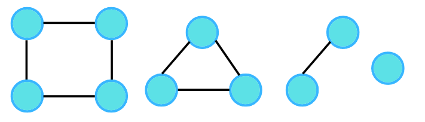

So far we've seen different types of graphs. Graphs can be connected or can be like a binary tree (as we know all trees are graphs with some restrictions) as shown in the following figure.

But what would you call the following figure?

The most common answer would be these are 4 different graphs as they are not connected. 

But is it possible to call them a single graph? To answer this, let us consider the question given:

Given an undirected graph with 10 nodes and 8 edges. The edges are (1,2), (1,3), (2,4), (4,3), (5,6), (5,7), (6,7), (8,9) .The graph that can be formed with the given information is as follows:

Apparently, it's a graph, which is in 4 pieces, the last one being a single node. In this case, we can say, the graph has been broken down into 4 different connected components. So next time if you see two different parts of a graph and they are not connected, then do not say that it cannot be a single graph. In the above example, they can be 4 different graphs but according to the given question and the input, we can call them parts of a single graph.

Graph Traversal 
In the upcoming topics, we’ll be learning about a lot of algorithms. Now, assume a traversal algorithm. Any traversal algorithm will always use a visited array. 

For the same example, we will create an array of size 11 (n+1) starting with the zeroth index. Initialize this visited array to zero, indicating that all the nodes are unvisited. Then follow the following algorithm. If a node is not visited, then call the traversal algorithm.

Why can’t we just call traversal(1)?

We cannot just call traversal(node) because a graph can have multiple components and traversal algorithms are designed in such a way that they will traverse the entire connected portion of the graph. For example, traversal(1) will traverse only the connected nodes, i.e., nodes 2, 3, and 4, but not the connected components.

Consider the following illustration to understand how a traversal algorithm will traverse the connected components.

